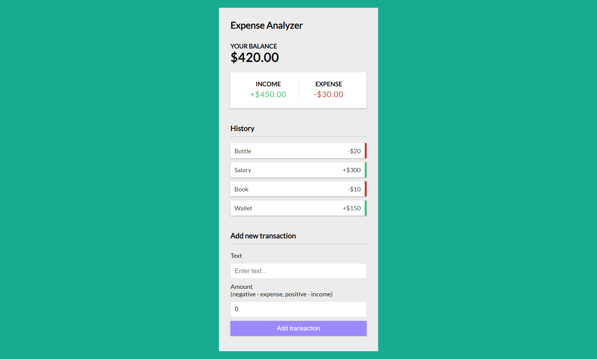

<div align="center">
    <h1>Expense Analyzer</h1>
    <p>A one page solution to track on all your expenses</p>
</div>



## Run it on your machine

1. Clone the project

   ```sh
   git clone https://github.com/karthik181194/react-projects.git
   ```

1. Install the dependencies

   ```sh
   cd expense-analyser-react
   npm install
   ```

3. Start the development server

   ```sh
   npm start
   ```

<div align="center">
    <p>
        Built with <a href="https://www.reactjs.org/" target="_blank">React.js</a>
    </p>
</div>